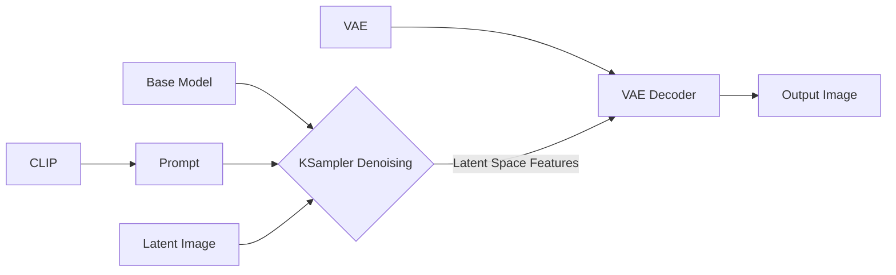
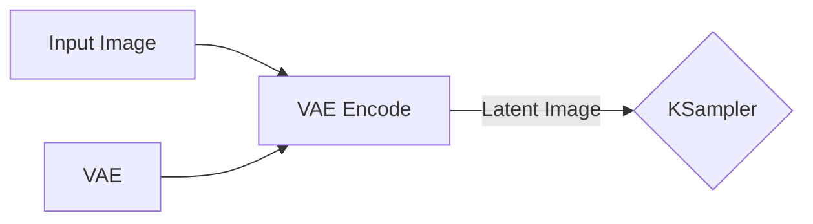
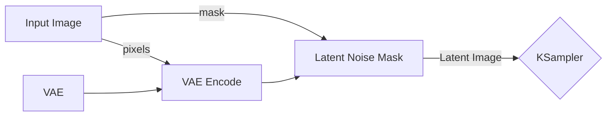
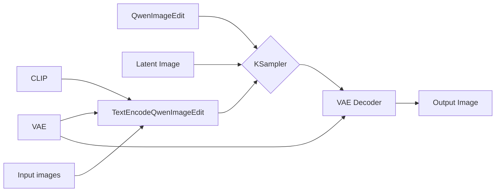
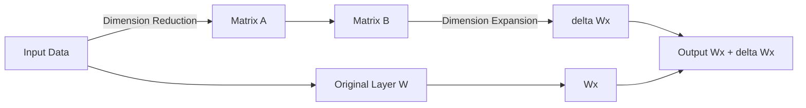

 This article was translated by gemini-3.5-flash 

This article introduces several AI image generation modes, specifically t2i, i2i, and r2i, which represent Text-to-Image, Image-to-Image, and Reference-to-Image, respectively. It also includes the i2t2i mode, which is a pipeline of Image-to-Text followed by Text-to-Image.

## Basic Concepts

The core components of AI image generation (taking Stable Diffusion as an example) include:
- Base Model (UNet/DiT): Responsible for denoising and feature prediction in the low-dimensional latent space (Latent Space).
- Text Encoder (CLIP): Parses natural language prompts and converts them into mathematical vectors that the model can understand.
- Variational Autoencoder (VAE): Acts as a bridge between the pixel space and the latent space. During the generation process, the VAE decoder restores the computed low-dimensional latent space data back into the final high-definition image.

In ComfyUI, the general workflow can be represented as:

## t2i (Text-to-Image)

Text-to-Image is the most basic generation mode, which generates corresponding images by inputting natural language descriptions or keywords.

Since no reference image is needed, the `Latent Image` mentioned above is actually constructed by inputting a random Gaussian noise canvas with only the width and height dimensions set.

As for prompts, current mainstream open-source models (SDXL, FLUX) deeply support coherent, long natural language sentences, whereas early SD models relied on tag-stacking styles. Therefore, when using newer models, simply describing the desired image accurately is sufficient.

## i2i (Image-to-Image)

Here, we discuss i2i in two ways: image reconstruction and mask reconstruction.

### Image Reconstruction

This requires extending the aforementioned Latent Image to actually inputting an image, which is then encoded into a Latent image via VAE to serve as the original input. In ComfyUI, it looks roughly like this:

At the same time, you need to control the `denoise` parameter in the KSampler to manage how much the model modifies the original image. The default value of `1.0` represents complete modification, and reducing this value decreases the extent to which the model alters the original image.

### Mask Reconstruction

Mask reconstruction builds on image reconstruction by adding a Mask to restrict the model to modifying only local parts of the original image. This also modifies the `Latent Image` part in the basic workflow. In ComfyUI, it looks roughly like this:

Here, you need to add a mask to the original image in the `Input Image` node to define the area that can be modified. Meanwhile, the `denoise` value of the `KSampler` is set according to your needs. If you want the masked area to be completely redrawn, set it to `1.0`; if you want the redrawing to refer more to the original image, lower this value.

## r2i (Reference-to-Image)

Here, r2i mainly refers to inputting multiple reference images and then generating an image based on prompts. Currently, GPT-Image-2 delivers stunning results, but for local deployment, you can also use models like Qwen-Image-Edit.

The workflow is actually similar to the one introduced in the basic section, except that image inputs are added to the prompt section. In ComfyUI, there is a dedicated `TextEncodeQwenImageEdit` node, which looks roughly like this:

In the `TextEncodeQwenImageEdit` node, you can write your prompts. Simply use natural language to describe how you want to modify the image. Meanwhile, the `Latent Image` here is set up just like in Text-to-Image, with only the width and height specified.

## i2t2i (Image-to-Text-to-Image)

If you want to know how an image was generated but don't know how to write prompts, you can use a Vision-Language (VL) model to convert the image into prompts. JoyCaption is a great choice, and there is also a compatible node for ComfyUI: <1038lab/ComfyUI-JoyCaption>

Since the original project explains it quite clearly, I won't go into detail here. By controlling the output length to limit it to a single set of prompts, you can directly connect it to a t2i workflow for automated image generation. However, I usually make minor modifications, so I haven't assembled a workflow for this mode myself. That said, in most cases, copying the prompts directly works perfectly and yields results very close to the original image (in terms of elements).

## LoRA (Low-Rank Adaptation) Training

AI-generated images are still based on the tagging of the training set. If you want to generate a specific style or character consistently, you might consider training a LoRA. The principle of LoRA is similar to first passing the input data through dimension reduction, then dimension expansion, and finally combining it with the original result to obtain the output. Since it involves two smaller matrices, the file size is usually quite small.

So, how do you train your own LoRA? First, you need to prepare some target images and tag them. You can use a VL model for tagging; for example, the aforementioned JoyCaption natively supports defining character names.

After generating tags for each image using it, filter them, and then use projects like <bmaltais/kohya_ss> or <kohya-ss/sd-scripts> to train your own character's LoRA!