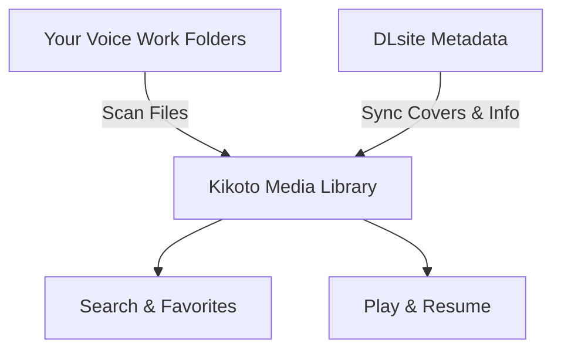
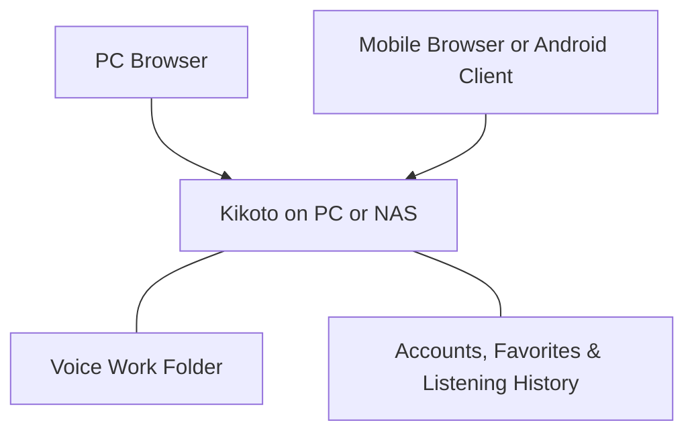

 This article was translated by gemini-3.5-flash 

This article was written by GPT-6.1 Sol.

As you buy more and more doujin voice works, your folders get longer and longer. Sometimes you only remember the cover art and the voice actor (CV) but can't recall the title; other times, you fall asleep halfway through last night and have to drag the progress bar around the next day to find your spot. Even though the files are right there on your hard drive, finding them and resuming playback still takes some effort.

Kikoto is an open-source doujin voice library I created to bring all these things together: browse works by cover art, find tracks by voice actors and tags, keep a wishlist, and resume right from where you left off. By deploying it on your PC or NAS, both your computer and phone can access the same library.


If you want to check out the interface first, you can open the [online demo](https://kikoto.yexca.net/). The demo site is read-only and showcases free all-ages works from DLsite. Kikoto itself does not provide any audio resources; it is designed to manage the works you have purchased.

## Turn Folders into a Searchable Media Library

Kikoto scans your designated voice work directory, identifies works from work IDs like `RJ` in the folder names, and then syncs titles, covers, circles, voice actors, and tags from DLsite. You can keep using your original directory structure without having to manually enter all the files first.

You can think of the library import process as two parallel tracks: one finds the files on your hard drive, and the other fills in the metadata, ultimately letting you browse and play everything in a single media library.



If you want to listen to a specific voice actor's work, you can search for their name directly. If you only remember the circle, part of the title, or the work ID, you can find it too. For more precise searches, you can use `tag: 癒し` to filter by tags. If a tag has corresponding multilingual names, searching with other languages will also match.

You can browse by recommendations, recently added, ratings, or release dates; if you don't want to choose, you can also browse randomly. Clicking into a circle or voice actor page allows you to explore more works from your favorite creators.


The details page brings together the cover art, production info, and file directory. Audio tracks can be played directly, and images, text, and subtitles in the same directory can also be previewed, so you don't have to switch back to your file manager to view accompanying content.

For multilingual works, there are two independent options: **Metadata Language** changes the display of titles, descriptions, and tags when corresponding content is available, while **Directory Version** switches the actual files. For example, you can browse Japanese audio tracks with Chinese titles, or open a saved English directory version. Changing the display language of the text does not alter the audio itself.

## Resume Right From Where You Left Off

Click an audio track to start playing, and other tracks in the same folder will be added to the queue. Playback continues even while you browse other works; the player can be collapsed and expanded again when you need to view lyrics or adjust the queue.

Kikoto saves your listening progress. The next time you open a work, clicking "Resume Playback" will take you right back to where you stopped, so you don't have to guess which track it was. If you want to listen to a specific track from the beginning, just click that track directly.


When a work includes subtitle files like LRC, VTT, or SRT, you can view them alongside the audio just like lyrics. You can also click on timestamped sentences to jump directly to that part—if you missed a line, just click back to it. If there are multiple matching lyric files, you can choose which one to use.

The player also supports speed adjustment, queue sorting, 10-second rewind, and 30-second fast-forward. When listening before sleep, you can set a sleep timer and have it rewind slightly upon stopping, making it easier to find the last segment you remember the next day.

Desktop browsers can display lyrics in a Picture-in-Picture window, and the Android client can display lyrics over other apps once granted overlay permissions. You don't have to stay on the player page just to read the lyrics.

## Organize What You Want to Hear and What You've Heard

Folders usually only tell you "what works exist," but a collection shelf can also tell you "what you plan to listen to, what you are currently listening to, and what you have already finished." Works can be marked with statuses like Wishlist, Listening, or Completed, and can also be placed into custom playlists, such as "Bedtime Listening," "Favorite Ear Cleaning (Mimikaki)," or "Stories to Replay."

Personal tags can be added to works, circles, and voice actors. Favorites, tags, and listening behavior contribute to recommendations, making it easier for the media library to surface works that match your preferences. Personal collections and listening data are saved separately for each account, allowing different organization styles within the same library.

## Manage Files Even When Scattered Across Different Locations

When your works are stored across multiple hard drives, you can use storage pools to add each drive as an independent media location. If a drive is temporarily disconnected, it will show as offline, but existing records of works on that drive will still be preserved during scans.

If you already have access to a Kikoeru-compatible service, you can also add it as a remote source to browse, play, or fetch files on demand. Local, cached, and remote locations for the same work are managed under a single work record, so you don't have to recreate favorites and listening history when file locations change.

Remote playback, caching, and fetching each have their own uses: playback is for direct listening, caching keeps a rebuildable media copy, and fetching saves selected files to your local media directory. If you only want to organize local works, starting with a single voice work folder is more than enough.

Tasks like scanning, syncing metadata, and fetching files can be run in "Workflows," with progress and results viewable in "Activities." You can set up automatic run rules when you need to scan periodically or follow new releases from specific circles or voice actors.

## Deploy Your Own Voice Library with Docker

You will need a computer or NAS capable of running Docker, along with your saved voice files. Once deployed, all files and account data remain on your own device, accessed via a web browser.



### Prepare Docker and the Deployment Directory

Windows users can install [Docker Desktop](https://docs.docs.com/desktop/setup/install/windows-install/); macOS users can use [OrbStack](https://orbstack.dev/download) or Docker Desktop; Linux users can install [Docker Engine](https://docs.docker.com/engine/install/) and the Compose plugin according to their distribution. For NAS, use the container management tool provided by your system.

After installation, first confirm that your terminal can execute:

```sh
docker compose version
```

Next, create a dedicated deployment folder, such as `D:\kikoto` on Windows. Download the [docker-compose.yml](https://github.com/yexca/kikoto/blob/main/docker-compose.yml) provided by the project, place it in this folder, and prepare the following directory structure:

```text
kikoto/
├── config/
├── cache/
├── data/
└── docker-compose.yml
```

`config` stores accounts, databases, and listening history; `cache` stores cache files; and `data` is used for voice files by default. On macOS or Linux, you can also download the configuration in the deployment directory using the following command:

```sh
curl -fL https://raw.githubusercontent.com/yexca/kikoto/main/docker-compose.yml -o docker-compose.yml
```

### Tell Kikoto Where Your Voice Files Are

Open `docker-compose.yml` and locate `volumes`. The default configuration is as follows (this is just a snippet of the full file):

```yaml
volumes:
  - ./config:/config
  - ./cache:/cache
  - ./data:/data
```

The left side of the colon in each line represents the folder on your computer, and the right side is the path seen inside the container. **If your voice files already exist in another directory, simply modify the path on the left; there is no need to copy them again.**

For example, if your voice files on Windows are located in `D:\Audio`, change it to:

```yaml
volumes:
  - ./config:/config
  - ./cache:/cache
  - "D:/Audio:/data"
```

Similarly, replace the directory on the left for macOS or Linux, for example, `/mnt/audio:/data`. For Windows paths, use `/` and wrap them in quotes, making sure to preserve the indentation of the original file when saving.

If you plan to use storage pools, keep `./data:/data` and map each drive to subdirectories like `/data/disk1`, `/data/disk2`, etc., then select the corresponding pool during the initial setup. For detailed configuration, please refer to the [User Guide](https://github.com/yexca/kikoto/blob/main/docs/user/zh-Hans/getting-started.md#存储池).

### Start and Complete Initial Setup

Open a terminal in the deployment directory, check the configuration first, and then start the service:

```sh
docker compose config --quiet
docker compose up -d
```

Once the image is downloaded and started, open `http://127.0.0.1:7655` on this computer. Your first visit will require you to create an administrator account. The initialization token can be found in the logs:

```sh
docker compose logs kikoto
```

Alternatively, you can read the `config/setup-token` file. Enter the token, set up your username and password, and then follow the media library wizard to complete the setup:

1. Choose between Normal Mode or Storage Pool Mode.
2. Scan the voice directory to find local works.
3. Sync metadata to fill in covers and descriptions.
4. Enable automatic scanning and folder monitoring as needed.

The work directory names must contain supported work IDs. If nothing shows up after scanning, check your directory mappings and folder names first. If covers do not appear immediately, you can check the progress of metadata synchronization under "Activities."

On Windows, you can also use [kikoto-helper.cmd](https://github.com/yexca/kikoto/blob/main/kikoto-helper/kikoto-helper.cmd) from the repository to prepare configurations, select your voice directory, and start the service via a menu interface.

### Accessing from Your Phone

Once your phone and the deployment device are connected to the same local network (LAN), access it using your computer's local IP address, for example, `http://192.168.1.23:7655`. You will need to replace this address with your own; `127.0.0.1` on a phone refers to the phone itself.

On Windows, you can use `ipconfig` to find the IPv4 address of your active Wi-Fi or Ethernet interface. If you cannot connect, check your computer's firewall settings and your router's guest network isolation. The deployment device must remain running.

The Android client can be downloaded from [GitHub Releases](https://github.com/yexca/kikoto/releases); simply enter the same server address. If you need to listen outside your home network, configure a trusted VPN or a reverse proxy with HTTPS.

## Backup and Daily Maintenance

The most important things to back up are your original voice files, along with the database and personal data inside `config`. The cache can usually be rebuilt. Kikoto also supports exporting and importing your personal collections, tags, and listening progress, allowing you to continue seamlessly when switching devices or instances.

Before updating, stop the service, back up `config` and your deployment configurations, and then pull the latest image to start:

```sh
docker compose stop
# Back up config, docker-compose.yml, and other deployment configurations
docker compose pull
docker compose up -d
```

For more operations, please [refer to the documentation](https://github.com/yexca/kikoto/blob/main/docs/user/index.md).

If you encounter any issues or have ideas, feel free to open an Issue in the repository.

