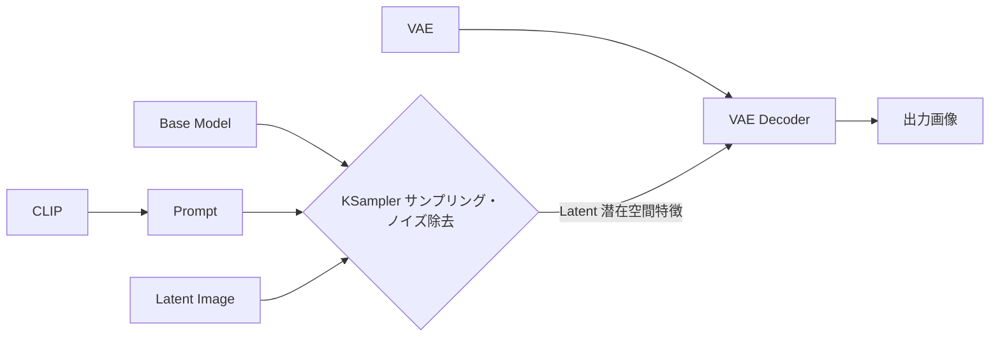
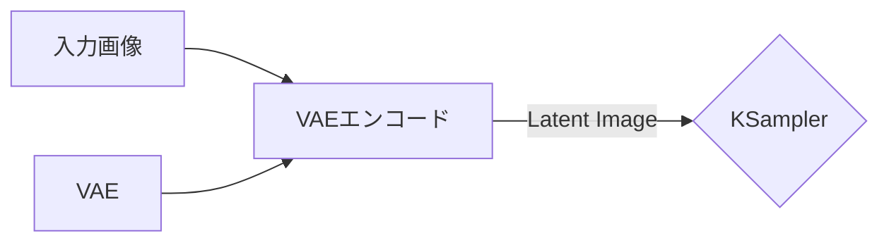
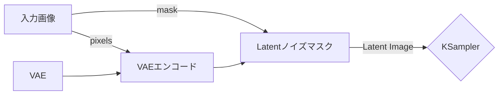
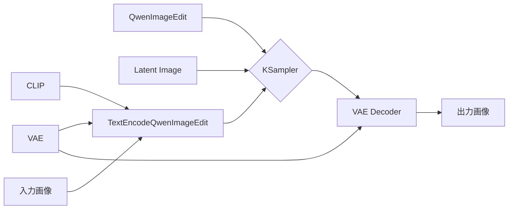
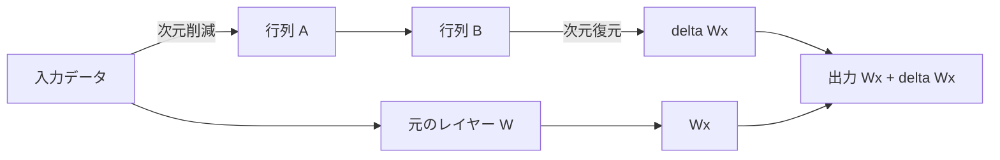

 この記事は gemini-3.5-flash によって翻訳されました 

本文では、いくつかの AI 画像生成モード（t2i、i2i、r2i：それぞれ Text-to-Image、Image-to-Image、Reference-to-Image）について紹介します。また、画像からテキストを生成し、さらにそのテキストから画像を生成するワークフローである i2t2i（Image-to-Text-to-Image）のパイプラインについても触れます。

## 基本概念

AI 画像生成（Stable Diffusion を例にとる）のコアコンポーネントは以下の通りです：
- **ベースモデル (UNet/DiT)**: 低次元の潜在空間（Latent Space）において、ノイズ除去と特徴予測を担当します。
- **テキストエンコーダー (CLIP)**: 自然言語のプロンプトを解析し、モデルが理解できる数学的ベクトルに変換します。
- **変分オートエンコーダー (VAE)**: ピクセル空間と潜在空間を繋ぐ架け橋の役割を担います。生成プロセスにおいて、VAE デコーダーは計算が完了した低次元の潜在空間データを最終的な高解像度画像へと復元します。

ComfyUI における一般的なフローは以下のように表されます。

## t2i (Text-to-Image): テキストから画像生成

Text-to-Image（文生図）は最も基本的な生成モードであり、自然言語による記述やキーワードを入力することで、対応する画像を生成します。

参考画像を必要としないため、上記の `Latent Image` は、実際には幅と高さのサイズのみを設定したランダムなガウスノイズのキャンバスを入力して画面を構築します。

プロンプト（キーワード）について、現在の主要なオープンソースモデル（SDXL、FLUX など）は、一貫性のある自然言語の長文を深くサポートしています。初期の SD モデルはタグを積み重ねるスタイルでしたが、比較的新しいモデルを使用する場合は、生成したい画像を正確に描写するだけで十分です。

## i2i (Image-to-Image): 画像から画像生成

ここでは、i2i を「画像再構成」と「マスク再構成」の 2 つのアプローチに分けて議論します。

### 画像再構成

ここでは、前述の `Latent Image` を拡張し、実際の画像を入力として受け取り、VAE を介して Latent 画像にエンコードして入力とします。ComfyUI でのフローはおおむね以下のようになります。

また、モデルが原画をどの程度変更するかを制御するために、KSampler 内の `denoise`（ノイズ除去強度）パラメータを調整する必要があります。デフォルト値の `1.0` は完全な再生成を意味し、この値を下げることで、モデルによる原画の変更度合いを抑えることができます。

### マスク再構成 (インペイント)

マスク再構成は、画像再構成にマスク（Mask）を加えることで、モデルが変更できる範囲を原画の局所的な部分に制限する手法です。これも同様に、基本ワークフローの `Latent Image` 部分を変更します。ComfyUI ではおおむね以下のようになります。

ここでは、`入力画像` モジュールで原画にマスクを追加し、変更可能な範囲を指定する必要があります。同時に、`KSampler` の `denoise` 値を必要に応じて設定します。マスク部分を完全に描き直したい場合は `1.0` に設定し、原画の要素をより多く残して描き直したい場合はこの値を下げます。

## r2i (Reference-to-Image): 参考画像からの生成

ここでの r2i は、主に複数の参考画像を入力し、プロンプトを用いて画像を生成することを指します。現在、非常に素晴らしい効果を発揮しているのは GPT-Image-2 ですが、ローカル環境であれば Qwen-Image-Edit などのモデルを使用することも可能です。

ワークフロー自体は基本セクションで紹介したものと似ていますが、プロンプト部分に画像の入力が追加されている点が異なります。ComfyUI には専用の `TextEncodeQwenImageEdit` コンポーネントがあり、おおむね以下のようになります。

このうち、`TextEncodeQwenImageEdit` コンポーネント内でプロンプトを記述できます。画像をどのように変更したいかを自然言語で描写するだけです。また、ここでの `Latent Image` は、Text-to-Image と同様に幅と高さのみを設定したものを使用します。

## i2t2i (Image-to-Text-to-Image): 画像からテキスト、そして画像へ

「ある画像がどのように生成されたか知りたいけれど、プロンプトの書き方がわからない」という場合、ビジョン言語（VL）モデルを使って画像をプロンプトに変換することができます。例えば JoyCaption は優れた選択肢の一つであり、ComfyUI 用のカスタムノードも存在します：<1038lab/ComfyUI-JoyCaption>

元のプロジェクトで十分に説明されているため詳細は省きますが、出力の長さを制限して単一のプロンプトセットに絞り込めば、そのまま t2i のワークフローに接続して自動生成を行うことができます。ただし、私は通常、生成されたプロンプトを少し手直しして使うため、このモードのワークフローを完全に自動化する形では組んでいません。それでも、多くの場合、出力されたプロンプトをそのままコピーして使用するだけで、原画と非常に近い要素を持つ画像を生成することができます。

## LoRA (Low-Rank Adaptation) の学習

AI が生成する画像は、学習データのタグ付け（ラベリング）に基づいています。特定のスタイルやキャラクターなどを安定して生成したい場合は、LoRA の学習を検討するとよいでしょう。LoRA の原理は、入力データを一度次元削減（降維）してから次元復元（升維）し、最終的に元の結果と結合して出力を得るというものです。2 つの小さな行列を使用するため、通常はファイルサイズも非常に小さくなります。

では、自分専用の LoRA をどのように学習させるかというと、まずターゲットとなる画像を用意し、それらにタグ付け（ラベリング）を行う必要があります。タグ付けには VL モデルを使用でき、例えば前述の JoyCaption はキャラクター名の定義をネイティブでサポートしています。

これを使って各画像のタグを生成した後にフィルタリングを行い、<bmaltais/kohya_ss> や <kohya-ss/sd-scripts> などのプロジェクトを利用して、自分だけのキャラクター LoRA を学習させることができます。