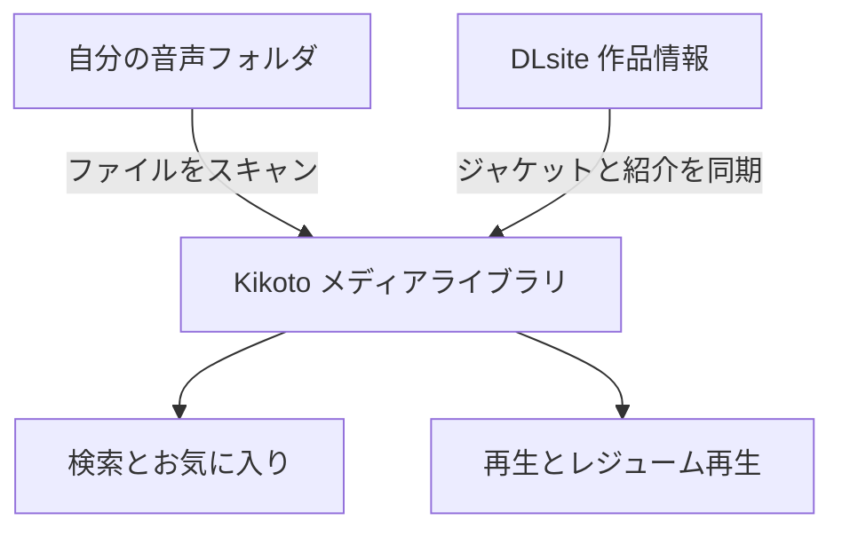
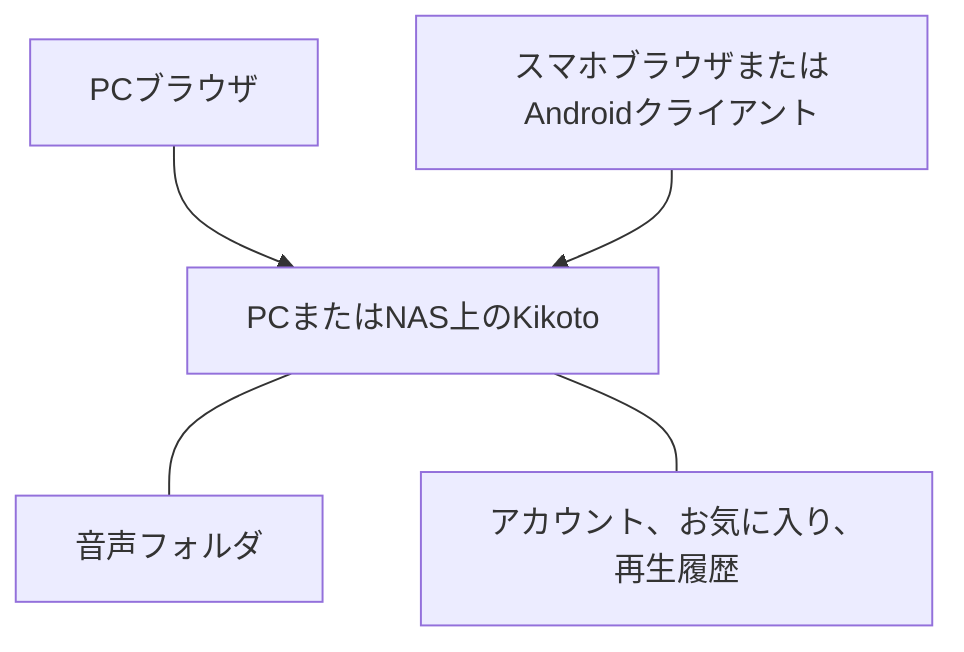

 この記事は gemini-3.5-flash によって翻訳されました 

この記事は GPT-6.1 Sol によって執筆されました。

同人音声がたくさん増えてくると、フォルダがどんどん長くなっていきます。時にはジャケット写真や声優（キャスト）は覚えているのに作品名が思い出せなかったり、昨晩途中まで聴いたのに、翌日またシークバーをドラッグして再生位置を探さなければならなかったりします。ファイルはすべて自分のハードディスクにあるのに、それを見つけて続きを聴くのには、まだ少し手間がかかります。

Kikotoは、私が開発したオープンソースの音声ライブラリです。これらの課題をすべて解決することを目指しています。ジャケット写真で作品をブラウズし、声優やタグで音声を検索し、聴きたいリストを記録し、前回停止した場所から再生を再開できます。PCやNASにデプロイすれば、PCからもスマートフォンからも同じライブラリにアクセスできます。


まずインターフェースを確認したい場合は、[オンラインデモ](https://kikoto.yexca.net/)を開いてみてください。デモサイトは読み取り専用で、DLsiteの無料全年齢作品を展示しています。Kikoto自体は音声リソースを提供しておらず、自分が購入した作品を管理するために使用します。

## フォルダを検索可能なメディアライブラリに

Kikotoは、指定された音声ディレクトリをスキャンし、フォルダ名に含まれる `RJ` などの作品番号から作品を識別し、DLsiteからタイトル、ジャケット写真、サークル、声優、タグを同期します。元のディレクトリはそのまま使用できるため、すべてのファイルを手動で登録し直す必要はありません。

ライブラリへの登録プロセスは、2つのラインとして理解できます。1つはハードディスク上のファイルを見つけること、もう1つは作品情報を補完することです。最終的に、同じメディアライブラリ内でブラウズと再生が行えます。



特定の声優の作品を聴きたい場合は、名前を直接検索できます。サークル名、タイトルの一部、または作品番号しか覚えていなくても見つけることができます。より正確に絞り込みたい場合は、 `tag: 癒し` のようにタグを指定できます。タグに対応する多言語名がある場合、他の言語の名前でもマッチします。

普段は、おすすめ、最近追加されたもの、評価、または発売日でブラウズできます。選ぶのが面倒なときは、ランダムに表示させることもできます。サークルや声優のページに入れば、お気に入りのクリエイターを辿って作品を探し続けることができます。


詳細ページでは、ジャケット写真、制作情報、ファイルディレクトリがまとめて表示されます。音声トラックは直接再生でき、同じディレクトリ内の画像、テキスト、字幕もプレビューできるため、付属コンテンツを確認する際にファイルマネージャーに戻る必要はありません。

多言語作品には2つの独立した選択肢があります。**メタデータ言語**は、対応するコンテンツがある場合にタイトル、紹介、タグの表示を切り替えます。**ディレクトリバージョン**は、実際のファイルを切り替えます。例えば、日本語の音声トラックを中国語のタイトルでブラウズしたり、保存済みの英語版ディレクトリを開いたりできます。文字の表示言語を切り替えても、音声自体は変わりません。

## 聴いた場所から、次回もそのまま再開

音声トラックをクリックして再生を開始すると、同じフォルダ内の他のトラックがキューに入ります。他の作品をブラウズしている間も再生は継続されます。プレイヤーは折りたたむことができ、歌詞の確認やキューの調整が必要なときに展開できます。

Kikotoは再生進捗を保存します。次回作品を開いたとき、「再生を再開」をクリックすれば、前回停止した位置に戻ることができます。どのトラックだったか推測する必要はありません。特定のトラックを最初から聴きたい場合は、そのトラックを直接クリックするだけです。


作品に LRC、VTT、SRT などの字幕ファイルが付属している場合、歌詞のように音声に合わせて表示できます。タイムスタンプ付きの文はクリックしてジャンプできるため、聞き逃した部分があってもクリックして戻るだけです。複数のマッチする歌詞ファイルがある場合は、自分で選択することもできます。

プレイヤーは、速度調整、キューの並べ替え、10秒戻る、30秒進む機能もサポートしています。就寝前に聴く場合は、スリープタイマーを設定し、停止後に少し巻き戻すように設定できるため、翌日に覚えている箇所を見つけやすくなります。

PCのブラウザでは、歌詞をピクチャー・イン・ピクチャー（PiP）の小窓に表示できます。Androidクライアントでは、フローティングウィンドウの権限を取得することで、他のアプリの上に歌詞を表示できます。歌詞を見るために、常にプレイヤーページに留まる必要はありません。

## 聴きたい作品と聴いた作品を整理する

フォルダは通常「どの作品があるか」しか教えてくれませんが、コレクション棚（お気に入り）は「何を聴く予定か、今何を聴いているか、何を聴き終えたか」も教えてくれます。作品は「聴きたい」「再生中」「完了」などのステータスでマークでき、自分で作成したコレクションリスト（例：就寝用、お気に入りの耳かき、もう一度聴きたいストーリーなど）に入れることもできます。

個人用タグは、作品、サークル、声優に付与できます。お気に入り、タグ、再生履歴はレコメンド機能に反映され、ライブラリが自分の好みに合った作品を表示しやすくなります。アカウントごとに個人のお気に入りや再生履歴データが個別に保存されるため、同じライブラリでも異なる整理方法が可能です。

## 文件が異なる場所に分散していても管理可能

作品が複数のハードディスクに分散している場合は、ストレージプールを使用して、各ディスクを独立したメディアロケーションとして追加できます。特定のディスクが一時的に接続されていない場合は「オフライン」と表示されますが、スキャン時にはそのディスク上の既存の作品記録が保持されます。

アクセス権のある Kikoeru 互換サービスをすでにお持ちの場合は、それをリモートソースとして追加し、ファイルのブラウズ、再生、または必要に応じた取得を行うことができます。同一作品のローカル、キャッシュ、リモートの場所は、単一の作品レコードを中心に管理されるため、ファイルの場所が変わってもお気に入りや再生履歴を重複して作成する必要はありません。

リモート再生、キャッシュ、Fetchにはそれぞれ用途があります。再生は直接聴くこと、キャッシュは再構築可能なメディアコピーを保持すること、Fetchは選択したファイルを自分のメディアディレクトリに保存することです。ローカル作品のみを整理したい場合は、1つの音声フォルダから始めるだけで十分です。

スキャン、作品情報の同期、ファイル取得などのタスクは「ワークフロー」で実行でき、進捗と結果は「アクティビティ」で確認できます。定期的なスキャンや、サークル・声優の新作のチェックが必要な場合は、対応する自動実行ルールを設定できます。

## Dockerで自分だけの音声ライブラリを構築する

Dockerを実行できるPCまたはNASと、保存済みの音声ファイルを用意する必要があります。デプロイが完了すると、ファイルとアカウントデータはすべて自分のデバイスに保存され、ブラウザからアクセスします。



### Dockerとデプロイディレクトリの準備

Windowsの場合は [Docker Desktop](https://docs.docker.com/desktop/setup/install/windows-install/) をインストールできます。macOSの場合は [OrbStack](https://orbstack.dev/download) または Docker Desktop を使用できます。Linuxの場合は、ディストリビューションに応じて [Docker Engine](https://docs.docker.com/engine/install/) と Compose プラグインをインストールします。NASの場合は、システムが提供するコンテナ管理ツールを使用します。

インストール後、まずターミナルで以下が実行できることを確認します。

```sh
docker compose version
```

次に、専用のデプロイフォルダ（例：Windowsの場合は `D:\kikoto`）を作成します。プロジェクトが提供する [docker-compose.yml](https://github.com/yexca/kikoto/blob/main/docker-compose.yml) をダウンロードしてこのフォルダに入れ、以下のディレクトリを準備します。

```text
kikoto/
├── config/
├── cache/
├── data/
└── docker-compose.yml
```

`config` にはアカウント、データベース、再生履歴が保存され、`cache` にはキャッシュが保存され、`data` はデフォルトで音声を置くために使用されます。macOSまたはLinuxでは、デプロイディレクトリで以下のコマンドを使用して設定をダウンロードすることもできます。

```sh
curl -fL https://raw.githubusercontent.com/yexca/kikoto/main/docker-compose.yml -o docker-compose.yml
```

### 音声の保存場所をKikotoに伝える

`docker-compose.yml` を開き、`volumes` を探します。デフォルトの設定は以下の通りです。これはファイル全体の一部です。

```yaml
volumes:
  - ./config:/config
  - ./cache:/cache
  - ./data:/data
```

各行のコロンの左側はPC上のフォルダ、右側はコンテナ内から見えるパスです。**音声がすでに別のディレクトリに存在する場合は、左側のパスを変更するだけでよく、コピーし直す必要はありません。**

例えば、Windowsで音声が `D:\Audio` にある場合は、以下のように変更します。

```yaml
volumes:
  - ./config:/config
  - ./cache:/cache
  - "D:/Audio:/data"
```

macOSやLinuxでも同様に左側のディレクトリを置き換えます（例：`/mnt/audio:/data`）。Windowsのパスは `/` を使用し、ダブルクォーテーションで囲みます。保存時は元のファイルのインデントを維持してください。

ストレージプールを使用する場合は、`./data:/data` をそのまま残し、各ディスクを `/data/disk1`、`/data/disk2` などのサブディレクトリとしてマッピングし、初回設定時対応するプールを選択します。具体的な設定は、[ユーザーガイド](https://github.com/yexca/kikoto/blob/main/docs/user/zh-Hans/getting-started.md#存储池)を参照してください。

### 起動と初回設定の完了

デプロイディレクトリでターミナルを開き、まず設定を確認してから起動します。

```sh
docker compose config --quiet
docker compose up -d
```

イメージがダウンロードされて起動したら、このPCで `http://127.0.0.1:7655` を開きます。初回アクセス時には管理者アカウントの作成が求められます。初期化トークンはログから確認できます。

```sh
docker compose logs kikoto
```

または、`config/setup-token` ファイルを読み取ることもできます。トークンを入力し、ユーザー名とパスワードを設定したら、メディアライブラリのウィザードに従って以下を完了します。

1. 通常モードまたはストレージプールモードを選択します。
2. 音声ディレクトリをスキャンし、ローカル作品を検出します。
3. 作品情報を同期し、ジャケット写真と紹介文を補完します。
4. 必要に応じて、自動スキャンとフォルダ監視を有効にします。

作品ディレクトリ名には、サポートされている作品番号が含まれている必要があります。スキャン後に何も表示されない場合は、まずディレクトリのマッピングとフォルダ名を確認してください。ジャケット写真が一時的に表示されない場合は、「アクティビティ」でメタデータ同期の進捗を確認できます。

Windowsでは、リポジトリ内の [kikoto-helper.cmd](https://github.com/yexca/kikoto/blob/main/kikoto-helper/kikoto-helper.cmd) を使用して、メニューから設定の準備、音声ディレクトリの選択、サービスの起動を行うこともできます。

### スマートフォンからのアクセス

スマートフォンとデプロイ先デバイスを同じローカルネットワーク（LAN）に接続し、PCのローカルIPアドレスでアクセスします（例：`http://192.168.1.23:7655`）。このアドレスはご自身の環境のものに置き換えてください。スマートフォンで `127.0.0.1` にアクセスすると、スマートフォン自体を指してしまいます。

Windowsでは、`ipconfig` を使用して実際のWi-FiまたはイーサネットインターフェースのIPv4アドレスを確認できます。接続できない場合は、PCのファイアウォールやルーターのゲストネットワーク分離設定を確認してください。デプロイ先デバイスは起動したままにしておく必要があります。

Androidクライアントは [GitHub Releases](https://github.com/yexca/kikoto/releases) からダウンロードできます。同じサーバーアドレスを入力するだけで使用できます。外出先から聴く必要がある場合は、信頼できるVPNやHTTPS対応のリバースプロキシを設定してください。

## バックアップと日常のメンテナンス

最も保存価値があるのは、音声のオリジナルファイルと、`config` 内のデータベースおよび個人データです。キャッシュは通常、再構築可能です。Kikotoは個人のお気に入り、タグ、再生履歴のインポート・エクスポートもサポートしているため、デバイスの変更やインスタンスの移行時にもそのまま使い続けることができます。

アップデートする前は、まずサービスを停止し、`config` とデプロイ設定をバックアップしてから、イメージをプルして起動します。

```sh
docker compose stop
# config や docker-compose.yml などのデプロイ設定をバックアップ
docker compose pull
docker compose up -d
```

詳細な操作については、[ドキュメントを参照](https://github.com/yexca/kikoto/blob/main/docs/user/index.md)してください。

問題が発生した場合やアイデアがある場合は、お気軽にリポジトリでIssueを作成してください。

