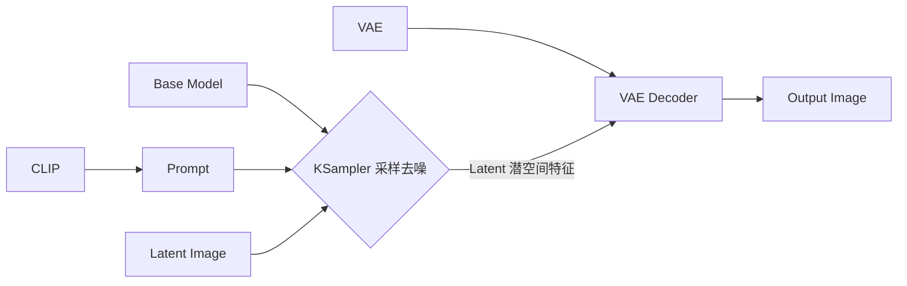
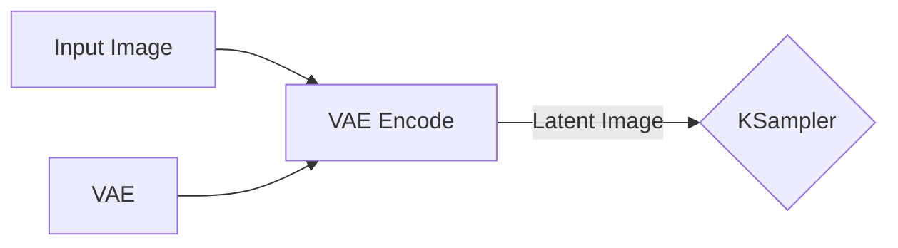
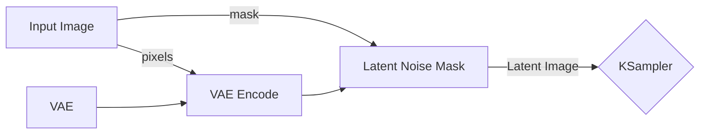
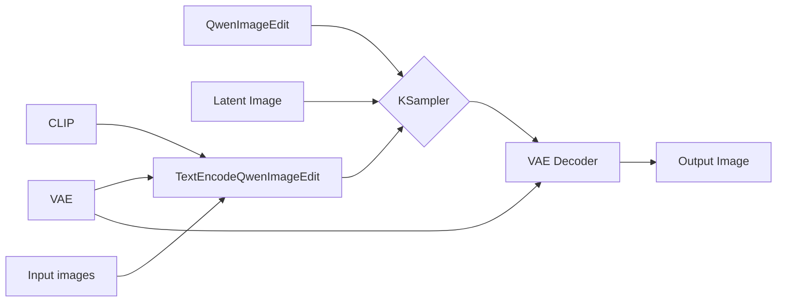
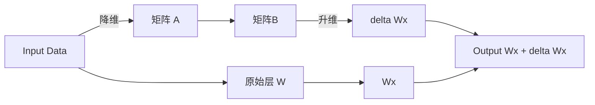

本文介绍几种 AI 生图模式，具体为 t2i, i2i, r2i，分别代表文生图，图生图，参考生图。同时加入 i2t2i 的模式，也就是图生文，然后文生图的一种串流

## 基础概念

AI 生图 (以 Stable Diffusion 为例) 的核心组件包括
- 底模 (UNet/DiT): 负责在低维潜空间 (Latent Space) 中进行去噪与特征预测
- 文本编码器 (CLIP): 将自然语言提示词解析并转化为模型可理解的数学向量
- 变分自编码器 (VAE): 负责像素空间与潜空间的桥梁转换。生成过程中，由 VAE 解码器将计算完成的低维潜空间数据还原为最终的高清图像

在 Comfyui 中一般的流程可以表示为

## t2i (Text-to-Image): 文生图

文生图是最基础的生成模式，即通过输入自然语言描述或关键词来生成对应的图像

因为不需要参考图，所以在上述的 `Latent Image` 实际上是输入一个只设定了宽高尺寸的随机高斯噪声画布进行构建画面即可

对于关键词，当前的主流开源模型 (SDXL, FLUX) 已经深度支持连贯的自然语言长句，而早期的 SD 模型是标签堆叠风格，所以对于使用较新模型来说，较为准确描述想要生成的图像即可

## i2i (Image-to-Image): 图生图

这里将 i2i 分为两种讨论方式，一种是图像重构，另一种为遮罩重构

### 图像重构

这里需要拓展上述的 Latent Image 为实际输入一个图像，并通过 VAE 编码为 Latent 图像作为原先的输入，在 Comfyui 中大概为

同时这里需要控制 KSampler 中的 `denose` 参数以控制模型对原图的修改程度，默认值 `1.0` 表示完全修改，而通过减弱该值以让模型修改原图的部分减少

### 遮罩重构

遮罩重构是在图像重构的基础上加上 Mask 用来限制模型只能修改原图的局部，同样也是修改在基础的工作流中 `Latent Image` 部分，在 Comfyui 中大概为

这里就需要在 `Input Image` 模块中对原图添加遮罩以规定可以被修改的范围，同时 `KSampler` 的 `denoise` 值根据需求进行设置。如果想要遮罩部分完全重新绘制就设置 `1.0` 如果想要重绘更多参考原图则降低该值

## r2i (Reference-to-Image): 参考生图

这里 r2i 主要是表示输入多张图片参考，然后通过提示词进行生图。当前效果惊艳的当属 GPT-Image-2 了，不过对于本地倒是也可以使用像是 Qwen-Image-Edit 模型

关于工作流事实上和基础段落中介绍的类似，只是在提示词部分多了图像的输入，同时在 Comfyui 中有专门的 `TextEncodeQwenImageEdit` 组件，大概如下

其中 `TextEncodeQwenImageEdit` 组件中可以进行提示词的书写。使用自然语言描述需要如何修改图像即可。同时这里的 `Latent Image` 使用和文生图一样的只设置宽度和高度即可

## i2t2i (Image-to-Text-to-Image): 图生文生图

对于想要知道一张图片如何生成而不会写提示词，可以使用 VL 模型将图片转换为提示词比如 JoyCaption 就是一个不错的选择，同时也有适用于 Comfyui 的组件：<1038lab/ComfyUI-JoyCaption>

因为源项目已经介绍比较清楚就不再继续写了，控制输出长度以限定到单组提示词后，完全可以直接接入 t2i 的工作流自动生图。不过我一般还是会稍微进行修改所以这个模式的工作流我并没有进行组装，但是多数时候直接将提示词复制过去后完全是可以直接使用且和原图差距不大 (指元素)

## Lora(Low-Rank Adaptation) 训练

AI 画出来的图片还是会基于训练集打标，如果想要让其较为稳定生成一种风格或角色等，可以考虑训练 Lora。关于 LoRA 的原理类似于，先将输入的数据经过降维度，然后升维，最终和原始结果结合在一起，从而获得输出。由于是两个较小的矩阵所以通常体积也会比较小

那么如何训练一个自己的 LoRA 呢，这里就需要准备一些目标图片，然后对其进行打标签了。打标签可以使用 VL 模型，比如上文提到的 JoyCaption 原生支持定义角色的名称

使用其生成每张图的标签后，进行筛选，然后通过像是 <bmaltais/kohya_ss> 或者 <kohya-ss/sd-scripts> 等项目进行训练自己角色的 LoRA 啦
