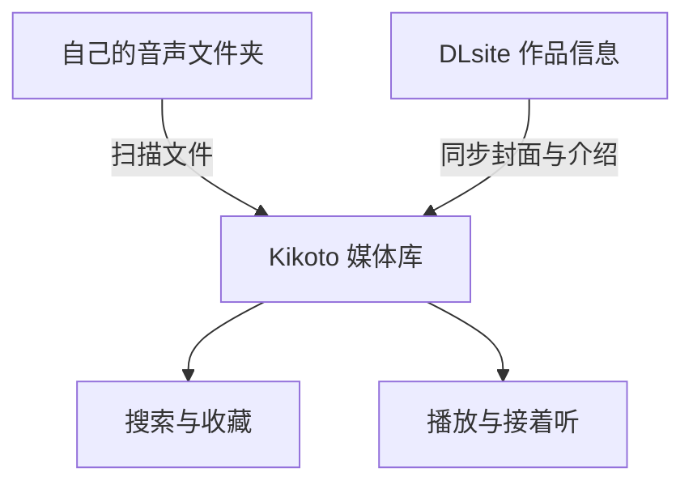
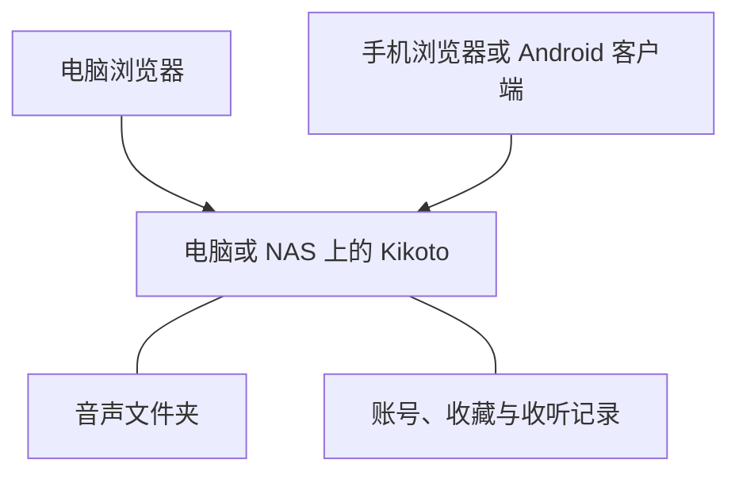

本文由 GPT-6.1 Sol 编写。

音声买得多了，文件夹就会越来越长。有时只记得封面和声优，却想不起作品名字；有时昨晚听到一半，第二天又要拖着进度条找位置。文件都在自己的硬盘里，找到它、接着听，却还要费一点功夫。

Kikoto 是我做的一个开源音声库，想把这些事情放到一起：用封面浏览作品，按声优和标签找音声，记下想听的列表，再从上次停下的地方继续。把它部署在电脑或 NAS 上，电脑和手机都能访问同一个库。


如果想先看看界面，可以打开[在线演示](https://kikoto.yexca.net/)。演示站只读，展示的是 DLsite 的免费全年龄作品；Kikoto 本身不提供音声资源，用来管理自己购买的作品。

## 把文件夹变成能搜索的媒体库

Kikoto 会扫描你指定的音声目录，从文件夹名称里的 `RJ` 等作品编号识别作品，再同步 DLsite 的标题、封面、社团、声优和标签。原来的目录可以继续使用，不必先把所有文件手工录入一遍。

可以把入库过程理解成两条线：一条找到硬盘上的文件，另一条补齐作品信息，最后在同一个媒体库里浏览和播放。



想听某位声优的作品，可以直接搜名字；只记得社团、标题的一部分或作品编号，也能找到。想更精确一点，可以用 `tag: 癒し` 限定标签。标签已经有对应的多语言名称时，用其他语言的名称也能匹配。

平时可以按推荐、最近添加、评分或发行日期浏览；不想挑的时候，也可以随机看看。点进社团或声优页面，就能顺着自己喜欢的创作者继续找作品。


详情页把封面、制作信息和文件目录放在一起。音轨可以直接播放，同目录里的图片、文本和字幕也能预览，查看附带内容时不用再切回文件管理器。

多语言作品有两个独立选择：**元数据语言**在有对应内容时改变标题、简介和标签的显示，**目录版本**切换实际文件。比如用中文标题浏览日文音轨，或者打开已经保存的英文版目录。切换文字的显示语言，不会改变音频本身。

## 听到哪里，下次就从哪里继续

点一条音轨开始播放，同文件夹的其他音轨会进入队列。浏览别的作品时，播放仍然继续；播放器可以收起，需要看歌词或调整队列时再展开。

Kikoto 会保存收听进度。下次打开作品，点「继续播放」就能回到上次停下的位置，不必先猜是哪一条音轨。想从头听某一条时，直接点那条音轨即可。


作品附带 LRC、VTT、SRT 等字幕文件时，可以像歌词一样跟着音频看。带时间轴的句子还能点击跳转，听漏了一句，点回去就好；有多个匹配的歌词文件时，也可以自己选择。

播放器还支持调速、队列排序、后退 10 秒和前进 30 秒。睡前听可以设置睡眠定时器，并让它停止后往回倒一点，第二天更容易找到还记得的段落。

电脑浏览器可以把歌词放进画中画小窗；Android 客户端获得悬浮窗权限后，也可以在其他应用上方显示歌词。看歌词不一定要一直停留在播放器页面。

## 把想听和听过的作品整理起来

文件夹通常只能告诉你「有哪些作品」，收藏架还可以告诉你「准备听什么、正在听什么、已经听过什么」。作品能标记为想听、正在听、已完成等状态，也能放进自己建立的收藏列表，例如睡前听、喜欢的耳かき、想重听的剧情。

个人标签可以加在作品、社团和声优上。收藏、标签和收听行为会参与推荐，让媒体库更容易呈现符合自己偏好的作品。账号之间分别保存个人的收藏与收听数据，同一个库也可以有不同的整理方式。

## 文件分散在不同地方也能管理

作品放在多块硬盘上时，可以使用存储池，把每块盘作为独立的媒体位置加入。某块盘暂时没接上，会显示离线，扫描时仍然保留这块盘上的已有作品记录。

如果已经有自己有权访问的 Kikoeru 兼容服务，也可以把它添加为远程来源，浏览、播放或按需取回文件。同一作品的本地、缓存与远程位置围绕同一条作品记录管理，收藏和收听记录不用跟着文件位置重复建立。

远程播放、缓存和 Fetch 各有用途：播放是直接收听，缓存是保留可重建的媒体副本，Fetch 则把选定文件保存到自己的媒体目录。只想整理本地作品的话，从一个音声文件夹开始就够了。

扫描、同步作品信息和文件获取等任务可以在「工作流」中运行，进度和结果在「活动」里查看。需要定期扫描、关注社团或声优的新作品时，再设置相应的自动运行规则。

## 用 Docker 搭建自己的音声库

需要准备一台能运行 Docker 的电脑或 NAS，以及已经保存的音声文件。部署完成后，文件和账号数据都放在自己的设备上，浏览器负责访问。



### 准备 Docker 和部署目录

Windows 可以安装 [Docker Desktop](https://docs.docker.com/desktop/setup/install/windows-install/)；macOS 可以使用 [OrbStack](https://orbstack.dev/download) 或 Docker Desktop；Linux 按发行版安装 [Docker Engine](https://docs.docker.com/engine/install/) 和 Compose 插件。NAS 则使用系统提供的容器管理工具。

安装后，先确认终端能够执行：

```sh
docker compose version
```

再建一个专门的部署文件夹，例如 Windows 下的 `D:\kikoto`。下载项目提供的 [docker-compose.yml](https://github.com/yexca/kikoto/blob/main/docker-compose.yml)，放进这个文件夹，并准备以下目录：

```text
kikoto/
├── config/
├── cache/
├── data/
└── docker-compose.yml
```

`config` 保存账号、数据库和收听记录，`cache` 保存缓存，`data` 默认用来放音声。macOS 或 Linux 也可以在部署目录中用下面的命令下载配置：

```sh
curl -fL https://raw.githubusercontent.com/yexca/kikoto/main/docker-compose.yml -o docker-compose.yml
```

### 告诉 Kikoto 音声放在哪里

打开 `docker-compose.yml`，找到 `volumes`。默认配置如下，这只是完整文件中的一个片段：

```yaml
volumes:
  - ./config:/config
  - ./cache:/cache
  - ./data:/data
```

每行冒号左边是电脑上的文件夹，右边是容器里看到的路径。**如果音声已经存在其他目录，修改左边的路径即可，不必再复制一份。**

例如 Windows 的音声放在 `D:\Audio`，改成：

```yaml
volumes:
  - ./config:/config
  - ./cache:/cache
  - "D:/Audio:/data"
```

macOS 或 Linux 同样替换左边的目录，例如 `/mnt/audio:/data`。Windows 路径使用 `/` 并加上引号，保存时保留原文件的缩进。

如果准备使用存储池，则保留 `./data:/data`，再把各块盘映射成 `/data/disk1`、`/data/disk2` 等子目录，首次设置时选择对应的池。具体配置可以参考[使用指南](https://github.com/yexca/kikoto/blob/main/docs/user/zh-Hans/getting-started.md#存储池)。

### 启动并完成首次设置

在部署目录打开终端，先检查配置，再启动：

```sh
docker compose config --quiet
docker compose up -d
```

镜像下载并启动后，在这台电脑上打开 `http://127.0.0.1:7655`。首次访问会要求创建管理员，初始化令牌可以在日志中找到：

```sh
docker compose logs kikoto
```

也可以读取 `config/setup-token` 文件。填入令牌，设置用户名和密码，然后跟着媒体库向导完成：

1. 选择普通模式或存储池模式。
2. 扫描音声目录，找到本地作品。
3. 同步作品信息，补齐封面和介绍。
4. 按需要开启自动扫描与文件夹监视。

作品目录名称需要包含受支持的作品编号。如果扫描后什么都没有，先检查目录映射和文件夹名称；封面暂时没出现，则可以到「活动」里看元数据同步的进度。

Windows 上也可以使用仓库里的 [kikoto-helper.cmd](https://github.com/yexca/kikoto/blob/main/kikoto-helper/kikoto-helper.cmd)，通过菜单准备配置、选择音声目录和启动服务。

### 从手机访问

手机与部署设备连到同一个局域网后，用电脑的局域网地址访问，例如 `http://192.168.1.23:7655`。这里的地址要换成自己的；`127.0.0.1` 在手机上指的是手机本身。

Windows 可以用 `ipconfig` 查看实际 Wi-Fi 或以太网接口的 IPv4 地址。连接不上时，再检查电脑防火墙和路由器的访客网络隔离。部署设备需要保持运行。

Android 客户端可以从 [GitHub Releases](https://github.com/yexca/kikoto/releases) 下载，填写同一个服务器地址即可。需要在外网收听时，再配置可信 VPN 或带 HTTPS 的反向代理。

## 备份与日常维护

最值得保存的是音声原文件，以及 `config` 里的数据库和个人数据。缓存通常可以重建。Kikoto 也支持导出、导入个人的收藏、标签和收听进度，换设备或换实例时可以继续使用。

更新前先停止服务，备份 `config` 与部署配置，再拉取镜像启动：

```sh
docker compose stop
# 备份 config 和 docker-compose.yml 等部署配置
docker compose pull
docker compose up -d
```

更多操作可以[查阅文档](https://github.com/yexca/kikoto/blob/main/docs/user/index.md)。

遇到问题或有想法，也欢迎到仓库提 Issue。


