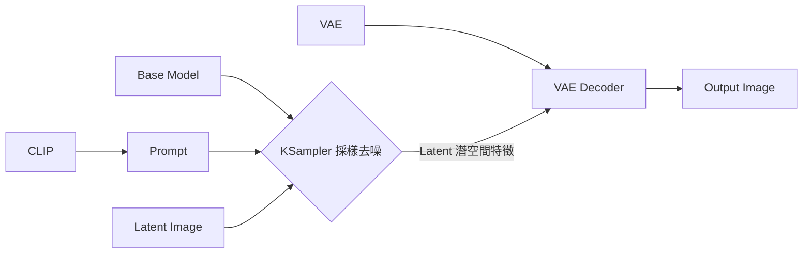
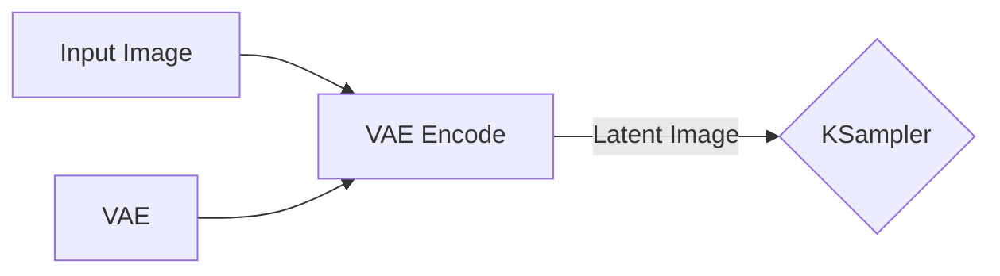
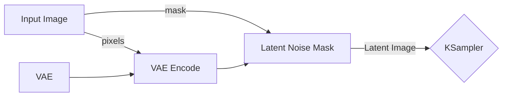
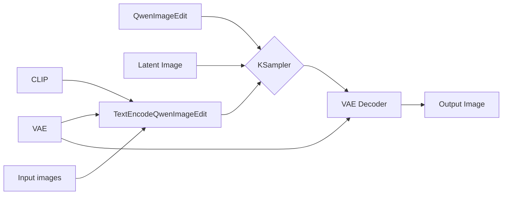
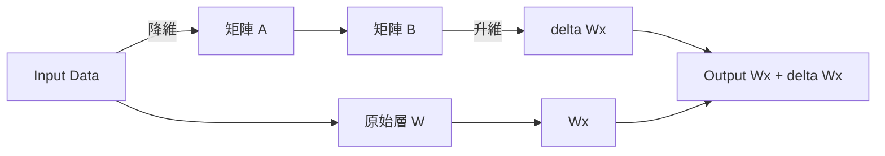

 本文由 gemini-3.5-flash 翻譯 

本文介紹幾種 AI 生圖模式，具體為 t2i, i2i, r2i，分別代表文生圖，圖生圖，參考生圖。同時加入 i2t2i 的模式，也就是圖生文，然後文生圖的一種串流

## 基礎概念

AI 生圖 (以 Stable Diffusion 為例) 的核心組件包括
- 底模 (UNet/DiT): 負責在低維潛空間 (Latent Space) 中進行去噪與特徵預測
- 文本編碼器 (CLIP): 將自然語言提示詞解析並轉化為模型可理解的數學向量
- 變分自編碼器 (VAE): 負責像素空間與潛空間的橋梁轉換。生成過程中，由 VAE 解碼器將計算完成的低維潛空間數據還原為最終的高清圖像

在 Comfyui 中一般的流程可以表示為

## t2i (Text-to-Image): 文生圖

文生圖是最基礎的生成模式，即通過輸入自然語言描述或關鍵詞來生成對應的圖像

因為不需要參考圖，所以在上述的 `Latent Image` 實際上是輸入一個只設定了寬高尺寸的隨機高斯噪聲畫布進行構建畫面即可

對於關鍵詞，當前的主流開源模型 (SDXL, FLUX) 已經深度支持連貫的自然語言長句，而早期的 SD 模型是標籤堆疊風格，所以對於使用較新模型來說，較為準確描述想要生成的圖像即可

## i2i (Image-to-Image): 圖生圖

這裡將 i2i 分為兩種討論方式，一種是圖像重構，另一種為遮罩重構

### 圖像重構

這裡需要拓展上述的 Latent Image 為實際輸入一個圖像，並通過 VAE 編碼為 Latent 圖像作為原先的輸入，在 Comfyui 中大概為

同時這裡需要控制 KSampler 中的 `denose` 參數以控制模型對原圖的修改程度，默認值 `1.0` 表示完全修改，而通過減弱該值以讓模型修改原圖的部分減少

### 遮罩重構

遮罩重構是在圖像重構的基礎上加上 Mask 用來限制模型只能修改原圖的局部，同樣也是修改在基礎的工作流中 `Latent Image` 部分，在 Comfyui 中大概為

這裡就需要在 `Input Image` 模組中對原圖添加遮罩以規定可以被修改的範圍，同時 `KSampler` 的 `denoise` 值根據需求進行設置。如果想要遮罩部分完全重新繪製就設置 `1.0` 如果想要重繪更多參考原圖則降低該值

## r2i (Reference-to-Image): 參考生圖

這裡 r2i 主要是表示輸入多張圖片參考，然後通過提示詞進行生圖。當前效果驚艷的當屬 GPT-Image-2 了，不過對於本地倒是也可以使用像是 Qwen-Image-Edit 模型

關於工作流事實上和基礎段落中介紹的類似，只是在提示詞部分多了圖像的輸入，同時在 Comfyui 中有專門的 `TextEncodeQwenImageEdit` 組件，大概如下

其中 `TextEncodeQwenImageEdit` 組件中可以進行提示詞的書寫。使用自然語言描述需要如何修改圖像即可。同時這裡的 `Latent Image` 使用和文生圖一樣的只設置寬度和高度即可

## i2t2i (Image-to-Text-to-Image): 圖生文生圖

對於想要知道一張圖片如何生成而不會寫提示詞，可以使用 VL 模型將圖片轉換為提示詞比如 JoyCaption 就是一個不錯的選擇，同時也有適用於 Comfyui 的組件：<1038lab/ComfyUI-JoyCaption>

因為源項目已經介紹比較清楚就不再繼續寫了，控制輸出長度以限定到單組提示詞後，完全可以直接接入 t2i 的工作流自動生圖。不過我一般還是會稍微進行修改所以這個模式的工作流我並沒有進行組裝，但是多數時候直接將提示詞複製過去後完全是可以直接使用且和原圖差距不大 (指元素)

## Lora(Low-Rank Adaptation) 訓練

AI 畫出來的圖片還是會基於訓練集打標，如果想要讓其較為穩定生成一種風格或角色等，可以考慮訓練 Lora。關於 LoRA 的原理類似於，先將輸入的數據經過降維度，然後升維，最終和原始結果結合在一起，從而獲得輸出。由於是兩個較小的矩陣所以通常體積也會比較小

那麼如何訓練一個自己的 LoRA 呢，這裡就需要準備一些目標圖片，然後對其進行打標籤了。打標籤可以使用 VL 模型，比如上文提到的 JoyCaption 原生支持定義角色的名稱

使用其生成每張圖的標籤後，進行篩選，然後通過像是 <bmaltais/kohya_ss> 或者 <kohya-ss/sd-scripts> 等項目進行訓練自己角色的 LoRA 啦