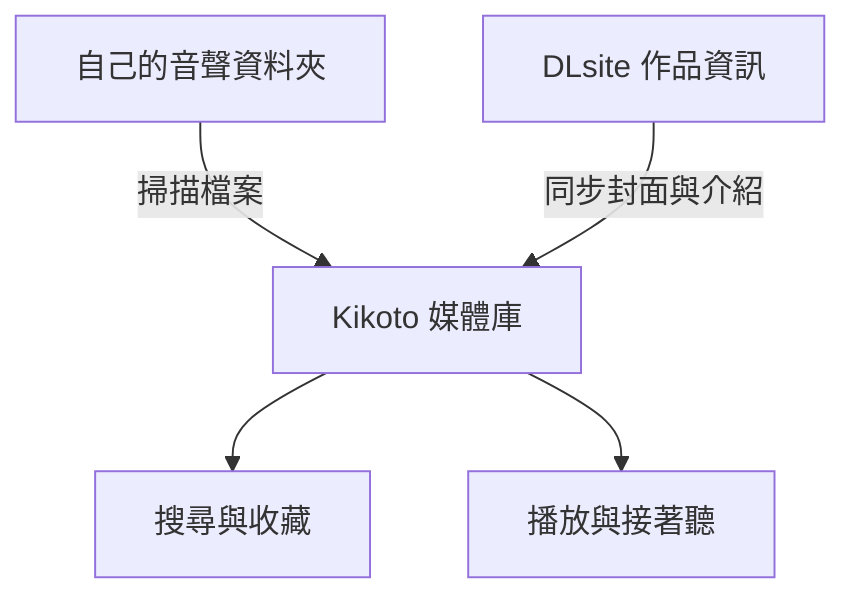
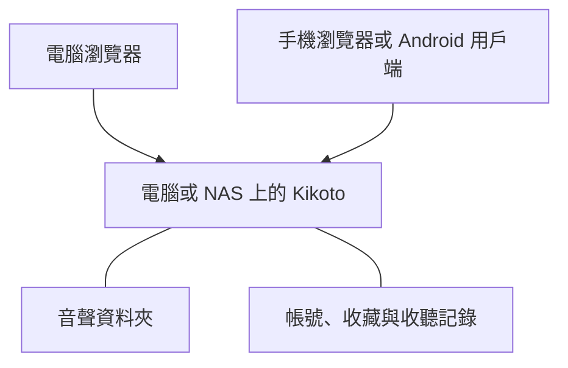

 本文由 gemini-3.5-flash 翻譯 

本文由 GPT-6.1 Sol 編寫。

音聲買得多了，資料夾就會越來越長。有時只記得封面和聲優，卻想不起作品名字；有時昨晚聽到一半，第二天又要拖著進度條找位置。檔案都在自己的硬碟裡，找到它、接著聽，卻還要費一點功夫。

Kikoto 是我做的一個開源音聲庫，想把這些事情放到一起：用封面瀏覽作品，按聲優和標籤找音聲，記下想聽的列表，再從上次停下的地方繼續。把它部署在電腦或 NAS 上，電腦和手機都能存取同一個庫。


如果想先看看介面，可以打開[線上展示](https://kikoto.yexca.net/)。展示站唯讀，展示的是 DLsite 的免費全年齡作品；Kikoto 本身不提供音聲資源，用來管理自己購買的作品。

## 把資料夾變成能搜尋的媒體庫

Kikoto 會掃描你指定的音聲目錄，從資料夾名稱裡的 `RJ` 等作品編號識別作品，再同步 DLsite 的標題、封面、社團、聲優和標籤。原來的目錄可以繼續使用，不必先把所有檔案手動輸入一遍。

可以把入庫過程理解成兩條線：一條找到硬碟上的檔案，另一條補齊作品資訊，最後在同一個媒體庫裡瀏覽和播放。



想聽某位聲優的作品，可以直接搜尋名字；只記得社團、標題的一部分或作品編號，也能找到。想更精確一點，可以用 `tag: 癒し` 限定標籤。標籤已經有對應的多語言名稱時，用其他語言的名稱也能匹配。

平時可以按推薦、最近新增、評分或發行日期瀏覽；不想挑的時候，也可以隨機看看。點進社團或聲優頁面，就能順著自己喜歡的創作者繼續找作品。


詳情頁把封面、製作資訊和檔案目錄放在一起。音軌可以直接播放，同目錄裡的圖片、文字和字幕也能預覽，查看附帶內容時不用再切回檔案管理器。

多語言作品有兩個獨立選擇：**元資料語言**在有對應內容時改變標題、簡介和標籤的顯示，**目錄版本**切換實際檔案。比如用中文標題瀏覽日文音軌，或者打開已經儲存的英文版目錄。切換文字的顯示語言，不會改變音訊本身。

## 聽到哪裡，下次就從哪裡繼續

點一條音軌開始播放，同資料夾的其他音軌會進入佇列。瀏覽別的作品時，播放仍然繼續；播放器可以收起，需要看歌詞或調整佇列時再展開。

Kikoto 會儲存收聽進度。下次打開作品，點「繼續播放」就能回到上次停下的位置，不必先猜是哪一條音軌。想從頭聽某一條時，直接點那條音軌即可。


作品附帶 LRC、VTT、SRT 等字幕檔案時，可以像歌詞一樣跟著音訊看。帶時間軸的句子還能點擊跳轉，聽漏了一句，點回去就好；有多個匹配的歌詞檔案時，也可以自己選擇。

播放器還支援調速、佇列排序、後退 10 秒和前進 30 秒。睡前聽可以設定睡眠定時器，並讓它停止後往回倒一點，第二天更容易找到還記得的段落。

電腦瀏覽器可以把歌詞放進畫中畫小視窗；Android 用戶端獲得懸浮視窗權限後，也可以在其他應用程式上方顯示歌詞。看歌詞不一定要一直停留在播放器頁面。

## 把想聽和聽過的作品整理起來

資料夾通常只能告訴你「有哪些作品」，收藏架還可以引導你「準備聽什麼、正在聽什麼、已經聽過什麼」。作品能標記為想聽、正在聽、已完成等狀態，也能放進自己建立的收藏列表，例如睡前聽、喜歡的耳かき、想重聽的劇情。

個人標籤可以加在作品、社團和聲優上。收藏、標籤和收聽行為會參與推薦，讓媒體庫更容易呈現符合自己偏好的作品。帳號之間分別儲存個人的收藏與收聽資料，同一個庫也可以有不同的整理方式。

## 檔案分散在不同地方也能管理

作品放在多顆硬碟上時，可以使用儲存池，把每顆硬碟作為獨立的媒體位置加入。某顆硬碟暫時沒接上，會顯示離線，掃描時仍然保留這顆硬碟上的已有作品記錄。

如果已經有自己有權存取的 Kikoeru 相容服務，也可以把它新增為遠端來源，瀏覽、播放或按需取回檔案。同一作品的本地、快取與遠端位置圍繞同一條作品記錄管理，收藏和收聽記錄不用跟著檔案位置重複建立。

遠端播放、快取和 Fetch 各有用途：播放是直接收聽，快取是保留可重建的媒體複本，Fetch 則把選定檔案儲存到自己的媒體目錄。只想整理本地作品的話，從一個音聲資料夾開始就夠了。

掃描、同步作品資訊和檔案獲取等任務可以在「工作流」中執行，進度和結果在「活動」裡查看。需要定期掃描、關注社團或聲優的新作品時，再設定對應的自動執行規則。

## 用 Docker 架設自己的音聲庫

需要準備一台能執行 Docker 的電腦或 NAS，以及已經儲存的音聲檔案。部署完成後，檔案和帳號資料都放在自己的裝置上，瀏覽器負責存取。



### 準備 Docker 和部署目錄

Windows 可以安裝 [Docker Desktop](https://docs.docker.com/desktop/setup/install/windows-install/)；macOS 可以使用 [OrbStack](https://orbstack.dev/download) 或 Docker Desktop；Linux 依發行版安裝 [Docker Engine](https://docs.docker.com/engine/install/) 和 Compose 外掛程式。NAS 則使用系統提供的容器管理工具。

安裝後，先確認終端機能夠執行：

```sh
docker compose version
```

再建立一個專門的部署資料夾，例如 Windows 下的 `D:\kikoto`。下載專案提供的 [docker-compose.yml](https://github.com/yexca/kikoto/blob/main/docker-compose.yml)，放進這個資料夾，并準備以下目錄：

```text
kikoto/
├── config/
├── cache/
├── data/
└── docker-compose.yml
```

`config` 儲存帳號、資料庫和收聽記錄，`cache` 儲存快取，`data` 預設用來放音聲。macOS 或 Linux 也可以在部署目錄中用下面的指令下載設定：

```sh
curl -fL https://raw.githubusercontent.com/yexca/kikoto/main/docker-compose.yml -o docker-compose.yml
```

### 告訴 Kikoto 音聲放在哪裡

打開 `docker-compose.yml`，找到 `volumes`。預設設定如下，這只是完整檔案中的一個片段：

```yaml
volumes:
  - ./config:/config
  - ./cache:/cache
  - ./data:/data
```

每行冒號左邊是電腦上的資料夾，右邊是容器裡看到的路徑。**如果音聲已經存在其他目錄，修改左邊的路徑即可，不必再複製一份。**

例如 Windows 的音聲放在 `D:\Audio`，改成：

```yaml
volumes:
  - ./config:/config
  - ./cache:/cache
  - "D:/Audio:/data"
```

macOS 或 Linux 同樣替換左邊的目錄，例如 `/mnt/audio:/data`。Windows 路徑使用 `/` 並加上引號，儲存時保留原檔案的縮排。

如果準備使用儲存池，則保留 `./data:/data`，再把各顆硬碟對應成 `/data/disk1`、`/data/disk2` 等子目錄，首次設定時選擇對應的池。具體設定可以參考[使用指南](https://github.com/yexca/kikoto/blob/main/docs/user/zh-Hans/getting-started.md#存储池)。

### 啟動並完成首次設定

在部署目錄打開終端機，先檢查設定，再啟動：

```sh
docker compose config --quiet
docker compose up -d
```

映像檔下載並啟動後，在這台電腦上打開 `http://127.0.0.1:7655`。首次存取會要求建立管理員，初始化權杖可以在記錄中找到：

```sh
docker compose logs kikoto
```

也可以讀取 `config/setup-token` 檔案。填入權杖，設定使用者名稱和密碼，然後跟著媒體庫精靈完成：

1. 選擇普通模式或儲存池模式。
2. 掃描音聲目錄，找到本地作品。
3. 同步作品資訊，補齊封面和介紹。
4. 依需要開啟自動掃描與資料夾監視。

作品目錄名稱需要包含受支援的作品編號。如果掃描後什麼都沒有，先檢查目錄對應和資料夾名稱；封面暫時沒出現，則可以到「活動」裡看元資料同步的進度。

Windows 上也可以使用儲存庫裡的 `kikoto-helper.cmd`，透過選單準備設定、選擇音聲目錄和啟動服務。

### 從手機存取

手機與部署裝置連到同一個區域網路後，用電腦的區域網路位址存取，例如 `http://192.168.1.23:7655`。這裡的位址要換成自己的；`127.0.0.1` 在手機上指的是手機本身。

Windows 可以用 `ipconfig` 查看實際 Wi-Fi 或乙太網路介面的 IPv4 位址。連線不上時，再檢查電腦防火牆和路由器的訪客網路隔離。部署裝置需要保持執行。

Android 用戶端可以從 [GitHub Releases](https://github.com/yexca/kikoto/releases) 下載，填寫同一個伺服器位址即可。需要在外網收聽時，再設定可信的 VPN 或帶有 HTTPS 的反向代理。

## 備份與日常維護

最值得儲存的是音聲原始檔案，以及 `config` 裡的資料庫和個人資料。快取通常可以重建。Kikoto 也支援匯出、匯入個人的收藏、標籤和收聽進度，換裝置或換執行個體時可以繼續使用。

更新前先停止服務，備份 `config` 與部署設定，再拉取映像檔啟動：

```sh
docker compose stop
# 備份 config 和 docker-compose.yml 等部署設定
docker compose pull
docker compose up -d
```

更多操作可以[查閱文件](https://github.com/yexca/kikoto/blob/main/docs/user/index.md)。

遇到問題或有想法，也歡迎到儲存庫提 Issue。

