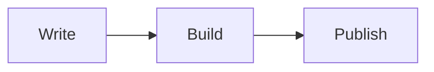

# Mermaid Diagrams

Mermaid support is opt-in at the page level. The site-wide default is disabled
in `hugo.yml`:

```yaml
params:
  article:
    mermaid: false
```

Enable it in a post with `mermaid: true` in the front matter, then use a normal
Mermaid fenced code block:

````markdown
---
mermaid: true
---


````

## Implementation

- `layouts/_default/_markup/render-codeblock-mermaid.html` converts enabled
  Mermaid fences to `<pre class="mermaid">` and falls back to Hugo's normal
  highlighter when the page switch is off.
- `assets/ts/features/mermaid.ts` loads Mermaid 11.16.1 from jsDelivr only when
  a page contains a Mermaid block, then calls `mermaid.run`.
- `assets/ts/core/pageInit.ts` re-runs the feature after same-origin soft
  navigation.
- `assets/scss/partials/components/mermaid.scss` overrides generic code-block
  decorations and keeps diagrams usable on narrow screens.

The feature keeps the original diagram source in a data attribute, so diagrams
can be rendered again after a light/dark theme change. If Mermaid fails to load
or a diagram is invalid, the source remains visible as a code-like fallback.
Mermaid stays at its default `strict` security level.

Translation automation intentionally does not change as part of this feature.
Mermaid blocks should be reviewed in translated posts if a future translation
job touches them.

## Verification

Check an enabled and a disabled post, multiple diagrams, invalid syntax, light
and dark schemes, mobile width, and soft navigation between ordinary and
Mermaid posts. Run a production build and the performance report; pages without
Mermaid diagrams should not request the Mermaid CDN module.
